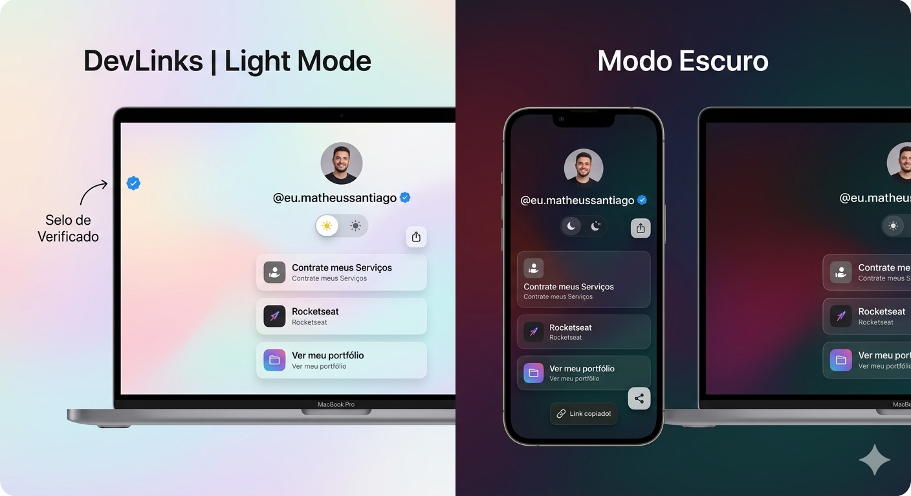

  

<h1 align="center"> DevLinks | Agregador de Links Premium </h1>

Projeto de agregador de links (estilo Linktree) desenvolvido com um design luxuoso inspirado na interface "Liquid Glass" da Apple. Criado para centralizar portfólio, contatos e redes sociais de forma moderna e responsiva.

  <a href="#-tecnologias">Tecnologias</a>&nbsp;&nbsp;&nbsp;|&nbsp;&nbsp;&nbsp;
  <a href="#-projeto">Projeto</a>&nbsp;&nbsp;&nbsp;|&nbsp;&nbsp;&nbsp;
  <a href="#-funcionalidades">Funcionalidades</a>&nbsp;&nbsp;&nbsp;|&nbsp;&nbsp;&nbsp;
  <a href="#memo-licença">Licença</a>

  

 

## 🚀 Tecnologias

Esse projeto foi desenvolvido com as seguintes tecnologias e técnicas avançadas:

- **HTML5:** Estrutura semântica, acessibilidade e otimização de Meta Tags (SEO e Open Graph para redes sociais).
- **CSS3:** Variáveis nativas (`:root`), animações em keyframes, propriedades de _Glassmorphism_ (backdrop-filter, blur, saturate) e responsividade.
- **JavaScript:** Manipulação do DOM, uso do `LocalStorage` para memória de tema e consumo da `Clipboard API` do navegador.
- **Ionicons:** Biblioteca de ícones vetoriais em alta qualidade.
- **Git e Github:** Versionamento de código e hospedagem.

## 💻 Projeto

O **DevLinks** é mais do que uma simples árvore de links. Ele foi projetado para atuar como um cartão de visitas digital de alta conversão. A interface utiliza princípios de design da Apple, empregando fundos com _Mesh Gradients_ fluidos e cartões translúcidos que reagem ao fundo da tela, criando uma sensação de profundidade e materialidade (Liquid Glass).

### 🌟 Funcionalidades de Destaque

- **Theme Switcher Estilo iOS:** Alternância fluida entre temas Light (Claro) e Dark (Escuro).
- **Memória de Usuário:** O site lembra a preferência de tema do visitante através do `LocalStorage`.
- **Botão Flutuante de Compartilhar:** Sistema nativo de cópia de URL com feedback visual através de um _Toast Notification_ (Aviso flutuante na tela).
- **Links Ricos:** Botões com ícones e subtítulos para aumentar a taxa de cliques (CTR).
- **Animações em Cascata:** Os elementos surgem suavemente na tela em sequência assim que a página é carregada.
- **Avatar Dinâmico:** A foto de perfil também se adapta caso o usuário troque entre o modo claro e escuro.

## 🔖 Layout

Você pode visualizar a aplicação rodando acessando o link do deploy:
 
👉 **[Inserir aqui o link do seu site hospedado, ex: Vercel, Netlify ou GitHub Pages]**

## :memo: Licença

Esse projeto está sob a licença MIT.

---

Made by **Dev Matheus Santiago** 👨‍💻
